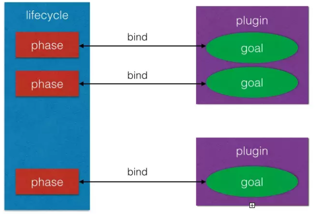

# test markdown blog file
> 这是一个测试markdown文件

scope | 说明 | 示例
-|-|-
compile | 编译是需要用到该jar包（默认） | commons-logging
test | 编译Test时需要用到该jar包 | junit
runtime | 编译时不需要，但运行时需要用到 | mysql
provided | 编译时需要用到，但运行时需要由JDK或者某个服务器提供 | servlet-api

